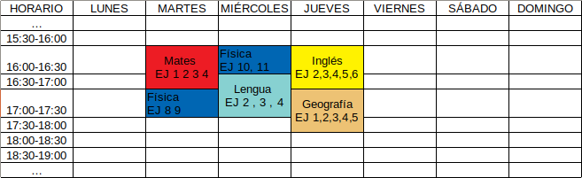

# User Journeys
Tras un día en un centro de enseñanza, el usuario tiene que realizar una serie de trabajos que tiene que entregar para una fecha.

En un momento tranquilo, por ejemplo cuando está en casa, empieza a pensar qué va a hacer hoy, cuándo (a qué hora), debería pensar también
para el día de mañana, pasado... Pero al día siguiente le pueden asignar más tareas, por tanto debería repensar su planificación. Esto puede llegar a ser complejo.

## Uso de la aplicación
La primera vez que entre tendrá una configuración por defecto en
la que se establecerá una franja de estudio por defecto, por ejemplo, de 16:00 a 21:00 todos los días de la semana. Podrá modificar esto a su gusto cuando lo desee. Además, para cada día en específico puede indicar una franja horaria. Es decir, por normal general su horario es de 16:00 a 21:00 pero el lunes puede indicar que trabajará de 17:00 a 19:00. Esta opción tendrá prioridad sobre la general. La específica la podrá indicar para un día en concreto, por ejemplo el 
22 de marzo, que podría ser un lunes, o indicarlo para todos los lunes.

Cuando el usuario tenga un momento, entrará en la aplicación desde su móvil o a través de la página web en el dispositivo que desee. Deberá indicar las tareas que tiene que realizar:
* Nombre de la asignatura
* Fecha de entrega o finalización
* Dificultad entre fácil, medio o difícil
* Tipo de tarea:
   *  No implica una serie de etapas, ejercicios, requisitos, etc.: proyecto o práctica evaluable
   * Implica un número de ejercicios, de objetivos, requisitos, etc. Se indican estos, por ejemplo, el número de los ejercicios (11,12,14,16), requisitos (R1, R2, R3)

El usuario tendrá una opción que indique al programa que calcule la planificación.
Se aplicará el algoritmo que implica la lógica de negocio y como resultado se obtendrá el horario con las franjas horarias de estudio que tiene que realizar para cada tarea. Por ejemplo:

Cuando se termina una jornada de trabajo, el usuario puede indicar si terminó
todas las tareas que tenía marcadas, si no las terminó o incluso si avanzó más, si esto es posible. Por tanto tiene 3 opciones:
* Indicar que las terminó tal y como estaba previsto o no indicar nada; por lo que se obtiene el mismo resultado
* No le dio tiempo a terminarlas, por lo que el sistema lo tendrá en cuenta y hará un nuevo cálculo del horario teniendo en cuenta que tiene que añadir un poquito más de tiempo para terminar las tareas no realizas más incrementar el tiempo estimado para terminar las tareas de esa asginatura
* Le dio tiempo a terminarlas e incluso avanzó más. Es el caso contrario al anterior. El sistema hará un nuevo cálculo donde reducirá el tiempo estimado de tareas del mismo tipo (misma asignatura por ejemplo)

¿Qué pasa si el tiempo disponible de un usuario es menor al tiempo que el 
sistema supone que necesita según las tareas marcadas por el usuario?
Pues el sistema notificará la cantidad de horas que necesita que el usuario añada.
Por ejemplo, una persona suma un total de 20 horas a la semana disponibles para
trabajar. Va apuntando sus tareas y añade tantas que el sistema calcula
unas 30 horas aproximadamente. Entonces la aplicación notificará al usuario
que debe de añadir 10 horas en esa semana.

Si el tiempo excedido es menor a un umbral, por ejemplo 1 hora, la aplicación
podría indicar que va muy ajustado en tiempo para que el usuario se mentalice en
que tiene que trabajar bastante o que añada más horas.

## Trabajos en grupo
Un equipo de x usuarios necesita hacer un trabajo en grupo. Uno de ellos
se encarga de crear la tarea y elige la opción de compartir con otros usuarios,
donde indicará el nombre del resto de usuarios o sus correos electrónicos.

El resto de usuarios recibirán una notificación en la app que les indique que
alguien quiere compartir una tarea. Ellos pueden aceptarla o denegarla. Cuando
todos hayan dado una respuesta, se les mostrará a cada uno sus nuevos horarios,
de manera que a todos les coinciden para la misma hora, duración y día/s el
trabajo en grupo.
